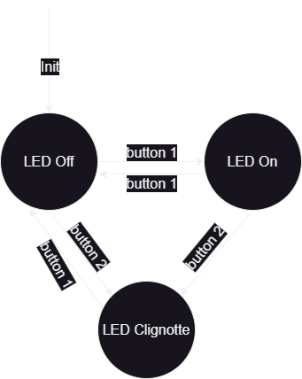

# FSM : Finite State Machine

__Intérêts des machines à état__ : meilleure lisibilité du code, code indépendant pour chaque état, l'ajout d'un nouvel état ne casse pas le reste.

Seulement 1 Etat à la fois. Le système est soit dans un état stable (arrêt) soit dans un état "il est en train de..." (avancer/monter/...).

Dans chaque état, on a des valeurs de sortie.

Les ronds sont des états, les flèches entre les ronds sont des transitions (des conditions par lesquelles on passe d'un état à l'autre).

# Exemples de code

A chaque fois, il y a le diagramme au format image (ex: fsm1-drawio.png) et le code associé (ex: fsm1-2buttons1LED.py)

À partir de fsm2, j'ai utilisé des classes plutot que des entiers pour gérer les états un peu mieux.

Les diagrammes peuvent aussi être ouverts (et surtout créés) avec le logiciel DrawIO (version online ou Desktop).

## fsm1 : 2 boutons permettent pour l'un d'alumer ou éteindre une LED, pour l'autre d'activer le Clignottement de la LED
Ici c'est seulement quand on relève le bouton que les changements d'état se font. Mais ce n'est pas le plus stable surtout quand ça devient plus complexe.

[Code : fsm1-2buttons1LED.py](fsm1-2buttons1LED.py)

## fsm2 : 1 bouton permet d'alumer ou éteindre une LED
Ici on distingue dans chaque état si le bouton et appuyé ou relevé

[Code : fsm2-1button1LED telerupteur.py](<fsm2-1button1LED telerupteur.py>)

## fsm3 : 1 bouton permet d'alumer ou éteindre ou faire clignotter une LED
Idem que fsm2 mais avec la gestion en plus du clignottement

[Code : fsm3-1button1LED telerupteur avec clignotte.py](<fsm3-1button1LED telerupteur avec clignotte.py>)
