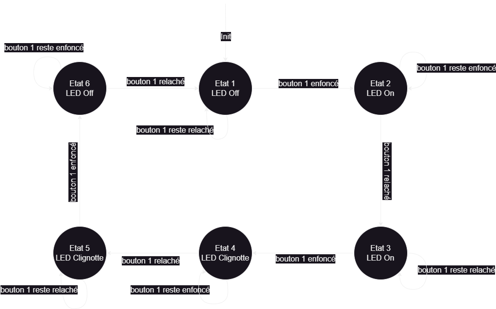

# FSM : Finite State Machine

### Intérêts des machines à état :

**meilleure lisibilité du code, code indépendant pour chaque état, l'ajout d'un nouvel état ne casse pas le reste.**

Seulement 1 Etat à la fois. Le système est soit dans un état stable (arrêt) soit dans un état "il est en train de..." (avancer/monter/...). 
Dans chaque état, on a des valeurs de sortie. 
Les ronds sont des états, les flèches entre les ronds sont des transitions (des conditions par lesquelles on passe d'un état à l'autre).  

# Exemples de code

A chaque fois, il y a le diagramme au format image (ex: fsm1-drawio.png) et le code associé (ex: fsm1-2buttons1LED.py) 
À partir de fsm2, j'ai utilisé des classes plutot que des entiers pour gérer les états un peu mieux.

Les diagrammes peuvent aussi être ouverts (et surtout créés) avec le logiciel DrawIO (version online ou Desktop).

## fsm1 : 2 boutons permettent pour l'un d'allumer ou d'éteindre une LED, pour l'autre d'activer le clignottement de la LED

Ici c'est seulement quand on relève le bouton que les changements d'état se font. Mais ce n'est pas le plus stable surtout quand ça devient plus complexe avec plus de boutons.

 
[Code : fsm1-2buttons1LED.py](fsm1-2buttons1LED.py)

## fsm2 : 1 bouton permet d'allumer ou d'éteindre une LED

Ici on distingue dans chaque état si le bouton et appuyé ou relevé. Ce qui sera plus stable si ça devient plus complexe.

 
[Code : fsm2-1button1LED telerupteur.py](<fsm2-1button1LED telerupteur.py>)

## fsm3 : 1 bouton permet d'allumer ou d'éteindre ou de faire clignotter une LED

Idem que fsm2 mais avec la gestion en plus du clignottement.

 
[Code : fsm3-1button1LED telerupteur avec clignotte.py](<fsm3-1button1LED telerupteur avec clignotte.py>)

## fsm4 : 1 bouton permet d'allumer ou d'éteindre ou de faire clignotter une LED

Idem que fsm1 mais avec 1 seul bouton, la gestion par IRQ et un Timer pour gérer les clignottements. 
Inclue aussi la gestion de l'anti-rebond du bouton. 
3 états stables : OFF/ON/Clignotte + 2 états intermédiaire : ON_begin/OFF_begin

 
[Code : fsm4-1button1LED with IRQ and timer.py](<fsm4-1button1LED with IRQ timer.py>)
